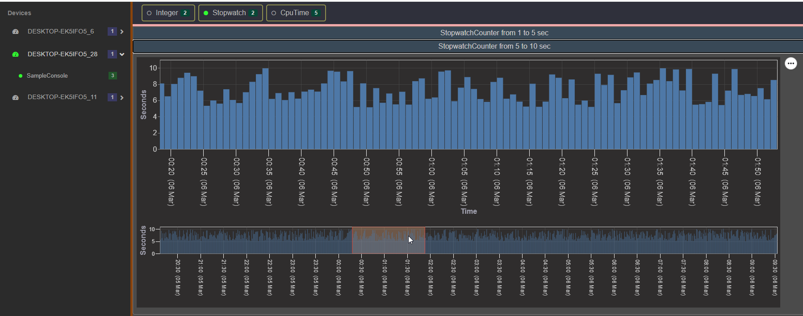

## Real-time Code Performance Counters

### Overview

This project offers real-time performance counters that can be seamlessly integrated into your codebase to gather insights about code execution. With these counters, developers can monitor CPU usage and execution times of specific code segments, including support for asynchronous operations and nested counters. Additionally, the counters support gathering information from various computers and processes. The collected data is transmitted to a storage service via HTTP and stored in a SQL database for further analysis.

### Usage Examples

---

#### CPU time counter with asynchronous operations and nested counters

```csharp
  using (new CpuTimeCounter("Random LoadCpu (parent + child) from 2 to 10 sec"))
  {
    await CpuLoader.LoadCpuAsync(rnd.Next(1 * 1000, 5 * 1000));
    await Task.Delay(rnd.Next(1 * 1000, 5 * 1000));

    using (new CpuTimeCounter("Random LoadCpu (child)  from 1 to 5 sec"))
    {
      await CpuLoader.LoadCpuAsync(rnd.Next(1 * 1000, 5 * 1000));
      await Task.Delay(rnd.Next(1 * 1000, 5 * 1000));
    }
  }
```

###### Visualization


---

#### Stopwatch counter for measuring execution time

```csharp
using (new StopwatchCounter("StopwatchCounter from 1 to 5 sec"))
{
  await Task.Delay(rnd.Next(1 * 1000, 5 * 1000));
}
```

###### Visualization



---

#### Integer counter

```csharp
  using (new IntegerCounter("IntegerCounter from 1000 to 5000").IncrementBy(rnd.Next(1000, 5000)))
  {
  }
```

###### Visualization


---

### Features

- Real-time Monitoring Track CPU usage and execution times of code segments.
- Support for Asynchronous Operations Monitor asynchronous code execution accurately.
- Nested Counters Measure performance within nested code blocks.
- Cross-Platform and Multi-Process Support Gather information from different computers and processes.
- Framework Versions
  - PerformanceCounters.Transmitter .NET Standard 2.0
  - PerformanceCounters.Hub .NET 8.0
  - ReactJS Client Version 18.2.0
- Communication Method Interaction between PerformanceCounters.Hub and Counters4AllClient is facilitated via SignalR.
- Graphical Visualization The ReactJS client utilizes VegaApi for displaying graphs to visualize CPU usage and wait times graphically.

### Components

- PerformanceCounters.Transmitter Library Provides functionality for collecting performance data.
- PerformanceCounters.Hub Service for transmitting and storing performance data.
- PerformanceCounters.Client ReactJS project for graphical visualization of performance data.

### Getting Started with Docker

1. Clone this repository.

   ```bash
   git clone https://github.com/AntonZanochkin/PerformanceCounters.git
   cd PerformanceCounters
   ```

2. Build and start the Docker containers.

   ```bash
   docker-compose up --build
   ```

3. Integrate the PerformanceCounters.Transmitter library into your project.

   - Include the library in your project's dependencies.
   - Connect the transmitter to the hub using the provided code snippet.

```csharp
   var transferService = new TransferService("http://localhost:5068/api/v1", "Server 1", "Application 1");
   transferService.Run();
```

4. Open your web browser and navigate to http://localhost:3000.
   You should see the performance data visualizations.
